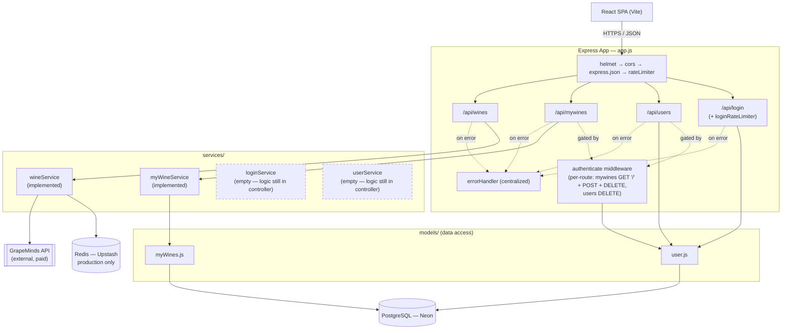
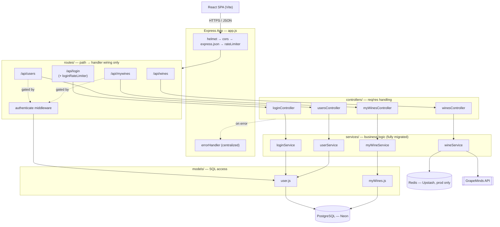
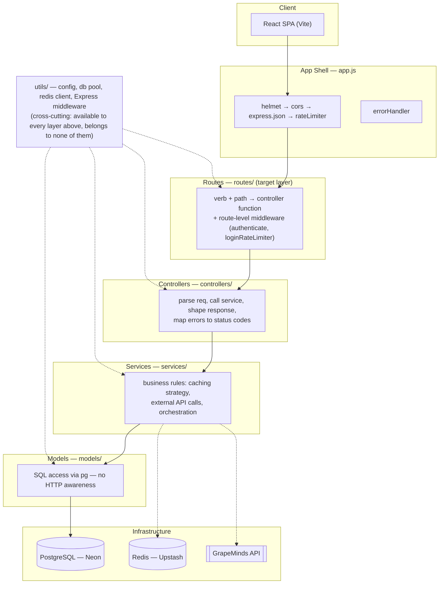
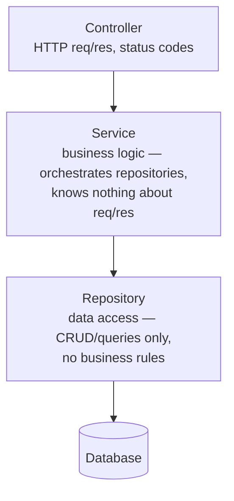
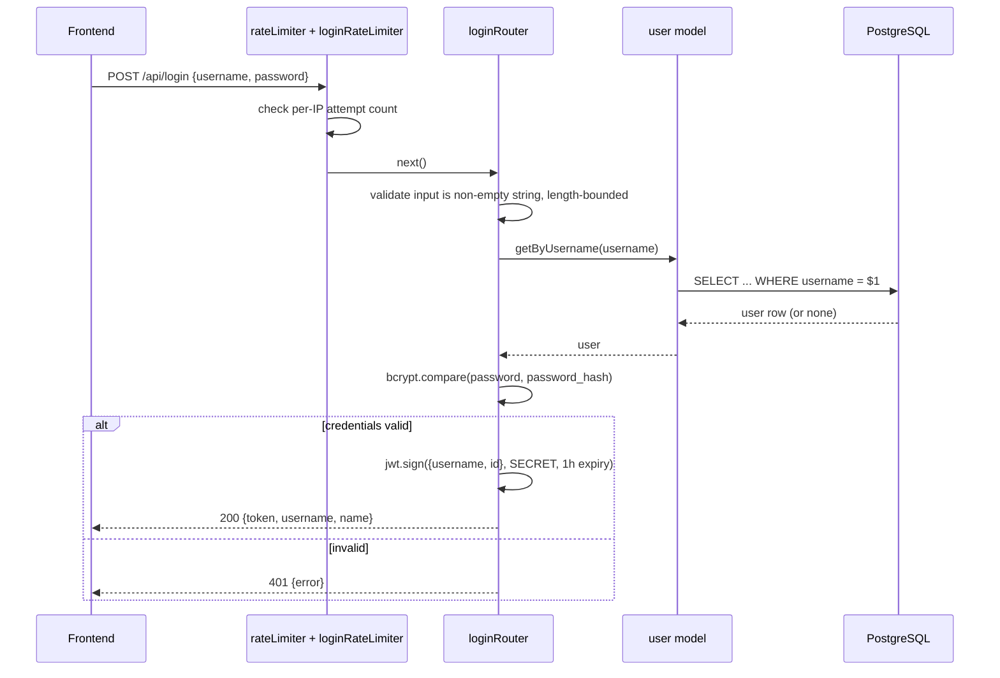
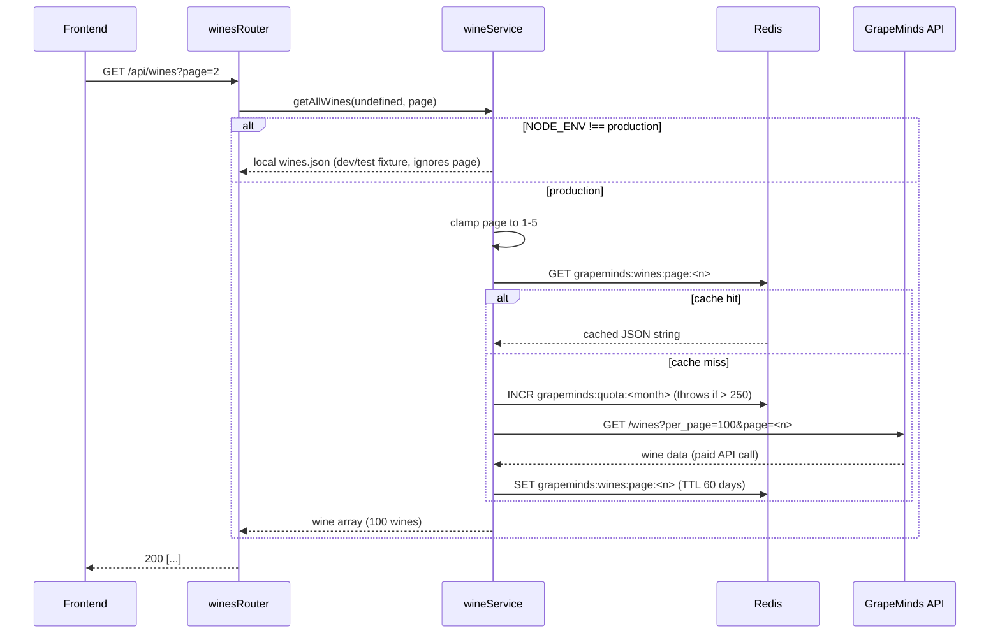
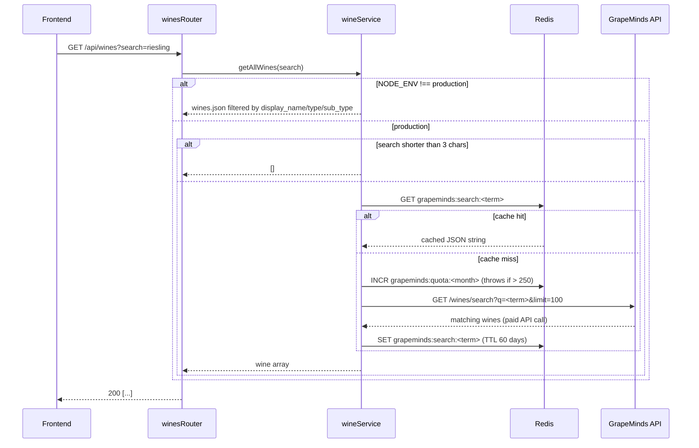

# KnowWine AI — Backend Architecture

## 1. Overview

The backend is a Node.js/Express REST API serving a React SPA. It owns three
concerns: user authentication, a user-curated wine list ("My Wines") backed
by PostgreSQL, and a browsable wine catalogue proxied and cached from a
third-party API (GrapeMinds).

| | |
|---|---|
| Runtime | Node.js, CommonJS |
| Framework | Express 5 |
| Primary datastore | PostgreSQL (Neon, serverless) |
| Cache | Redis (Upstash), production only |
| Auth | JWT (`jsonwebtoken`) + bcrypt password hashing |
| External integration | GrapeMinds wine catalogue API |
| Security middleware | Helmet (CSP), CORS, hand-rolled rate limiting |

## 2. High-Level Architecture

Dashed `-.gated by.->` arrows mark routes that run the shared `authenticate`
middleware (`utils/authenticate.js`) before their handler; dashed boxes mark
services that exist as files but currently contain no code — see
[§8 Known Issues](#8-known-issues--technical-debt).

### 2.1 Target Architecture (Post-Refactor)

`controllers/` today actually holds Express `Router` objects (path + handler
wiring), not controller logic in the conventional sense — the two concerns
are merged into one file per domain. The target state separates them into a
dedicated `routes/` layer plus a `controllers/` layer of plain handler
functions, and finishes the `login`/`users` service-layer migration called
out in §8 so every domain follows the same four-layer shape:

The reshuffle is a pure code-organization change — since the test suite
(§`tests/`) drives everything through `supertest` against the assembled
`app`, it exercises routes/controllers/services identically either way and
needs no changes itself.

### 2.2 Layered View (Bottom-Up)

Same target architecture, drawn as a classic layer stack instead of a
per-domain graph — each band may only call downward into the band directly
beneath it, never sideways into another domain's internals or upward back
into a caller:

Reading bottom to top: **infrastructure** (Postgres/Redis/GrapeMinds) is
reached only through **models** (SQL) or directly from **services** for the
two external stores that aren't relational data; **services** hold all
business logic and never touch `req`/`res`; **controllers** are the only
layer allowed to read `req` or write `res`; **routes** just wire HTTP
verb+path combinations to a controller function plus any middleware; the
**app shell** applies process-wide middleware before any route matches.
`utils/` sits outside the stack — every layer may reach into it, but it
never reaches back up.

### 2.3 Simplified Controller–Service–Repository View

Stripped of KnowWine-specific detail (domains, external cache, middleware),
the same target architecture is a textbook instance of the
**Controller–Service–Repository (CSR) pattern** — a 3-tier layered
architecture where the data layer uses the Repository pattern:

| Layer | Repo mapping | Rule |
|---|---|---|
| Controller | `controllers/` | Only layer that touches `req`/`res` |
| Service | `services/` | Only layer that contains business rules |
| Repository | `models/` — same role, different name | Only layer that writes SQL |
| Database | PostgreSQL | No logic — storage only |

`models/` in this codebase already *is* the repository layer; naming it
`repositories/` instead is a cosmetic rename, not a structural change —
useful mainly if the team wants the more common cross-language vocabulary
(Java/C#/NestJS shops call this layer "repository", Node/Express projects
often say "model" for the same thing).

## 3. Layered Design

| Layer | Responsibility | Should know about |
|---|---|---|
| **Routes** (`routes/`, target — currently merged into `controllers/`) | Map HTTP verb + path → controller function, attach route-level middleware (e.g. `authenticate`) | Express routing only — no business logic |
| **Controllers** (`controllers/`) | Parse `req`, call service/model, shape HTTP response, map errors to status codes | Express, HTTP |
| **Services** (`services/`) | Business rules: caching strategy, external API calls, orchestration across models | Domain logic — nothing about `req`/`res` |
| **Models** (`models/`) | Raw SQL access via `pg` | SQL only |
| **Utils** (`utils/`) | Cross-cutting: DB pool, Redis client, config, Express middleware | Infra |

**Current state:** the **wines** and **mywines** domains follow the
service-layer split fully — their `controllers/` routers delegate to
`services/wineService.js` and `services/myWineService.js`. Shared JWT
verification has also been extracted out of the controllers entirely into
`utils/authenticate.js`, a route-level middleware reused by both `mywines`
and `users`. The **login** and **users** domains still have their remaining
business logic (bcrypt hashing/comparison, user-creation validation)
written directly in the router file, since `loginService.js` and
`userService.js` are still empty. None of the four domains yet separate
routing from handler logic into `routes/` — see §2.1 for the target shape.

## 4. Request Lifecycle

Every request passes through this middleware chain, in order
(`app.js`):

1. `helmet()` — security headers + Content-Security-Policy (see §7)
2. `cors()` — origin locked to the frontend's own origin per environment
3. `express.json({ limit: '1mb' })` — body parsing, payload size cap
4. `rateLimiter` — global IP-based rate limit (50 req/15min in production, 500 in dev)
5. Route match (`/api/login`, `/api/users`, `/api/mywines`, `/api/wines`)
   - `/api/login` additionally passes through `loginRateLimiter`
     (8 attempts/15min in production) before the login handler — a
     tighter, brute-force-specific limit layered on top of the global one
6. `unknownEndpoint` — catches anything unmatched → 404
7. `errorHandler` — centralized error → status code mapping (see §6)

## 5. Domain Walkthrough

### 5.1 Authentication (`POST /api/login`)

Downstream routes (`/api/mywines` POST/DELETE, `/api/users` DELETE) verify
the JWT with `jwt.verify` and re-fetch the user from the database on every
request — the token carries only `{ username, id }`, it is not trusted for
authorization decisions beyond identifying the user.

### 5.2 Wine catalogue — browsing (`GET /api/wines`)

GrapeMinds' real catalogue has ~264,700 wines across ~2,650 pages of 100; the app deliberately
never tries to mirror it — see §5.2's quota note and [ADR-002](#adr-002-bound-catalogue-browsing-to-5-pages-instead-of-full-pagination).

`page` is clamped server-side to **1–5** even if a client requests higher — browsing is bounded
deliberately, since paging through all ~2,650 real pages would exhaust the entire 250/month quota
on browsing alone (see §8 for the resolved issue this replaced). Each page is cached under its
own key so pages don't overwrite each other, and a near-simultaneous duplicate request for the
same uncached page shares one in-flight GrapeMinds call instead of firing two.

### 5.2b Wine catalogue — search (`GET /api/wines?search=`)

Unlike the old design, **search proxies to GrapeMinds' own `/wines/search` endpoint** rather than
filtering whatever catalogue page happens to be cached — this is what actually reaches the full
264k-wine catalogue instead of only the ≤500 wines ever cached for browsing. Search is cached
separately from the browsing pages (`grapeminds:search:<term>`, distinct Redis keys) since the two
serve different purposes and shouldn't invalidate each other.

### 5.2c Wine detail (`GET /api/wines/:id`)

Proxies to GrapeMinds' `GET /wines/:id`, cached per id (`grapeminds:wine:<id>`, 60-day TTL). 404s
are cached too (as `null`) so a bad or stale id doesn't cost quota on every repeat request — a
broken link or a bot hitting the same missing id repeatedly is otherwise indistinguishable from a
legitimate cache-miss traffic pattern. `getWineById` falls back to a local `wines.json` lookup in
dev/test, same as the other two paths.

### 5.3 My Wines (`/api/mywines`)

Standard authenticated CRUD over the `my_wines` table, scoped to the
requesting user (`user_id` foreign key). Deletes verify ownership
(`wine.user_id === user.id`) before allowing the operation — a user cannot
delete another user's entry even with a valid token.

## 6. Error Handling

All routes funnel unexpected errors to `next(error)`, handled centrally by
`errorHandler` (`utils/middleware.js`):

| Condition | Response |
|---|---|
| Malformed JSON body | `400 Invalid JSON` |
| Postgres unique violation (`23505`) | `400 name must be unique` |
| Invalid/expired JWT | `401 token invalid` / `401 token expired` |
| Anything else | `500 Internal server error` (generic message — no stack trace leaked) |

## 7. Security Posture

- **Helmet + CSP**: default directives plus two explicit relaxations —
  `worker-src blob:` (maplibre-gl parses map tiles in a blob worker) and
  `connect-src https://demotiles.maplibre.org` (map demo tiles). Any future
  third-party asset needs an explicit CSP allowance here, not a blanket
  `unsafe-inline`/`*`.
- **`trust proxy`**: set to `1` (trust exactly one hop) in production, `false`
  otherwise. Trusting the whole `X-Forwarded-For` chain would let a client
  spoof `req.ip` and bypass IP-keyed rate limiting entirely.
- **Rate limiting**: in-memory, per-process (`utils/middleware.js`). Two
  tiers — global (50/15min) and login-specific (8/15min). This is
  brute-force mitigation, **not** DDoS protection — a distributed attack
  spread across many IPs is not slowed by a per-IP counter, and true
  volumetric protection belongs at the CDN/edge layer, not here.
- **Passwords**: bcrypt, cost factor 10, never logged or returned in any
  response payload.
- **CORS**: locked to a single explicit origin per environment, not a
  wildcard.

## 8. Known Issues & Technical Debt

Ordered by severity — this is the section to work through next.

### High

1. **Service layer is still partially migrated.** `services/loginService.js`
   and `userService.js` exist but are empty files — `controllers/login.js`
   and `users.js` still contain their business logic (JWT signing, bcrypt,
   validation) inline. `myWineService.js` and `wineService.js` now follow
   the intended controller → service → model split. Until login/users are
   finished, those two domains are harder to unit test and the layering is
   inconsistent across the codebase.

### Resolved

2. ~~**External catalogue pagination is hardcoded to page 1.**~~ **Resolved.**
   Browsing now covers pages 1–5 (clamped server-side, see §5.2) instead of
   only page 1, and search (§5.2b) proxies to GrapeMinds' own
   `/wines/search` endpoint instead of filtering the cached browsing pages
   — it reaches the full catalogue, not just whatever's cached for
   browsing. Full, unbounded pagination through GrapeMinds' ~2,650 real
   pages remains an explicit non-goal — see
   [ADR-002](#adr-002-bound-catalogue-browsing-to-5-pages-instead-of-full-pagination).

### Medium

3. **No ORM, query builder, or migration tool.** Schema is created ad-hoc
   via `CREATE TABLE IF NOT EXISTS` in `utils/db.js#initDb()` on every
   startup. There is no versioned migration history and no rollback path —
   a destructive schema change today has no safety net. Decision on the
   replacement tool: see [ADR-001](#adr-001-adopt-drizzle-orm-for-schema-migrations-and-query-building).

4. **`express-rate-limit` is installed but unused.** `utils/middleware.js`
   still has hand-rolled, in-memory, per-process rate limiters instead.
   Worth a deliberate decision: adopt the library and delete the hand-rolled
   code, or remove the unused dependency.

   `express-validator` is no longer in this category — it now backs the
   `POST` body validation in `controllers/users.js`
   (`createUserValidation`) and `controllers/mywines.js`
   (`createWineValidation`), including explicit `.isString()` checks so a
   non-string field (number, object, boolean) is rejected with a `400`
   instead of being silently coerced to a string and stored. Still on the
   old hand-rolled pattern: `controllers/login.js` (manual `isValid` check)
   and every `:id` route param (`Number(req.params.id)` +
   `Number.isNaN` in both `users.js` and `mywines.js`) — those should move
   to `body()`/`param()` validators too for consistency.

## 9. Recommended Next Steps

1. Finish the service-layer extraction for login/users/mywines, following
   the same pattern already established in `wineService.js`.
2. Adopt Drizzle ORM + `drizzle-kit` (see [ADR-001](#adr-001-adopt-drizzle-orm-for-schema-migrations-and-query-building))
   before the schema changes again; folding new `ALTER TABLE` statements
   into `initDb()` indefinitely does not scale.
3. Finish the `express-validator` migration: convert `controllers/login.js`
   to a `body()` validation chain (matching `users.js`/`mywines.js`), and
   replace the repeated manual `Number(req.params.id)` / `Number.isNaN`
   checks with a shared `param('id').isInt()` validator reused across both
   controllers.
4. Split `routes/` out of `controllers/` per the target architecture in
   §2.1 — each domain's `Router` wiring moves to `routes/<domain>.js`,
   leaving `controllers/<domain>Controller.js` as plain handler functions.
   Best done together with step 1 so login/users land directly in the
   four-layer shape instead of being migrated twice.
5. If usage ever grows enough that 5 cached browsing pages + on-demand
   search feels limiting, revisit [ADR-002](#adr-002-bound-catalogue-browsing-to-5-pages-instead-of-full-pagination)
   — e.g. a slow background job that persists a handful of new pages per
   day, well under the 250/month quota, rather than raising the bound
   naively.

## 10. Architecture Decision Records (ADRs)

Short log of decisions that aren't obvious from reading the code alone —
what was chosen, why, and what was given up. Format: Status / Context /
Decision / Consequences / Alternatives considered.

### ADR-001: Adopt Drizzle ORM for schema migrations and query building

**Status:** Proposed (not yet implemented — tracks [Known Issue §8.3](#8-known-issues--technical-debt))

**Context:** Data access is hand-written parameterized SQL via `pg`
directly in `models/` (the repository layer, §2.3). Schema is created
ad-hoc by `CREATE TABLE IF NOT EXISTS` in `utils/db.js#initDb()` on every
boot — no versioned migrations, no rollback path. The backend is plain
CommonJS JavaScript (no TypeScript), runs on Render's free tier (spins
down after 15 min idle, ~30s cold-start wake per §Deployment), and talks to
Neon serverless PostgreSQL.

**Decision:** Introduce **Drizzle ORM** + **`drizzle-kit`** for schema
definition, versioned migrations, and query building, replacing the
hand-rolled SQL in `models/` incrementally (one table at a time —
`users` first, then `my_wines`).

**Why Drizzle over Prisma:**

- **No separate query-engine process.** Drizzle is a thin, compiled
  wrapper over the driver — it doesn't spin up an additional engine on
  cold start. That matters concretely here: this project already pays a
  cold-start tax on Render's free tier, so anything that adds engine
  startup latency on top of that is a cost worth avoiding.
- **First-class Neon HTTP driver** (`drizzle-orm/neon-http`) — a
  fetch-based, stateless driver built specifically for serverless Postgres
  like Neon, with no connection-pool warm-up needed after a cold start.
- **Stays close to SQL.** The query builder mirrors the parameterized SQL
  already written by hand in `models/`, so the repository layer becomes
  typed and composable without being hidden behind a fully generated
  client — smaller conceptual jump, and dropping to raw SQL for an
  edge case stays easy.
- **Closes Known Issue §8.3 directly** — `drizzle-kit` produces versioned,
  diffable migration files with a rollback path, replacing the ad-hoc
  `CREATE TABLE IF NOT EXISTS` startup logic.
- **No TypeScript dependency.** Prisma's headline benefit — a generated,
  fully-typed client — buys little in a plain-JS backend; Drizzle's
  runtime-footprint advantage holds regardless of TS.

**Consequences:**

- Smaller ecosystem than Prisma: less Stack Overflow coverage, no
  Prisma Studio-equivalent GUI out of the box, docs are good but younger.
- `models/` gets rewritten file-by-file against Drizzle's query builder —
  mechanical but not free; sequence it one table at a time rather than a
  big-bang rewrite so `mywines`/`users` tests keep passing throughout.
- The first `drizzle-kit` migration must snapshot the *current* schema
  before any new `ALTER TABLE` lands, or the migration history starts
  from a false baseline.

**Alternatives considered:**

- **Prisma** — more mature tooling, generated client, Prisma Studio for
  ad-hoc DB inspection. Rejected primarily for the added engine-layer
  weight on a spin-down-prone free host; revisit if the backend adopts
  TypeScript (where Prisma's generated types pay off more) or if admin/DB
  inspection tooling becomes a real need.
- **`node-pg-migrate`** — migrations only, no query builder; would have
  closed §8.3 alone but left the hand-rolled SQL in `models/` untouched.
  Rejected because it solves only half the problem this ADR addresses.

### ADR-002: Bound catalogue browsing to 5 pages instead of full pagination

**Status:** Implemented

**Context:** GrapeMinds' real catalogue has ~264,700 wines across ~2,650 pages of 100 at
`GET /wines?per_page=100&page=N`. The app's plan caps usage at **250 requests/month**. Browsing
was originally hardcoded to `page=1` only (§8, resolved) — the naive fix would be to loop through
every page and persist the whole catalogue, but that alone costs ~2,650 requests, more than 10x
the entire monthly budget, in a single run.

**Decision:** Clamp browsing server-side to pages **1–5** (`MAX_BROWSABLE_PAGES` in
`wineService.js`), each cached under its own Redis key with a 60-day TTL. This bounds worst-case
first-time cost to 5 requests total (then free until the cache expires), and bounds it
*predictably* — unlike search, where a user can type arbitrarily many distinct terms, "browsing"
has a hard, known ceiling of 5 page-loads regardless of how many users click through it.

**Why not full pagination:** Sequential pages share no cache-reuse advantage the way popular
search terms do — every new page is a guaranteed cache miss the first time, and a single user
clicking "next" through the catalogue could exhaust the entire month's quota alone (see the
frontend's pagination UI, capped at 5 pages in lockstep with this server-side bound). Search
(§5.2b) is the quota-efficient path to the rest of the catalogue — it proxies to GrapeMinds' own
`/wines/search`, so a user reaches exactly the wines they're looking for at a cost of one request
per distinct search term, not one per page of everything.

**Consequences:**

- Only 500 of ~264,700 wines are ever browsable via the paginated table; the rest are reachable
  only through search. This is a deliberate product tradeoff, not an oversight.
- If traffic ever justifies more browsable depth, the fix is a slow, budget-aware background
  expansion (e.g. 1-2 new pages/day) rather than raising `MAX_BROWSABLE_PAGES` outright — see
  [§9 Recommended Next Steps](#9-recommended-next-steps).

**Alternatives considered:**

- **Full pagination (all ~2,650 pages)** — rejected outright; costs more than 10x the monthly
  quota to populate once, before counting search or wine-detail traffic.
- **Persisting the catalogue to PostgreSQL instead of Redis-only** — would remove the "TTL expiry
  forces a repeat paid call" risk, and is worth revisiting if catalogue depth becomes a real
  product requirement, but wasn't necessary to fix the immediate page-1-only bug.