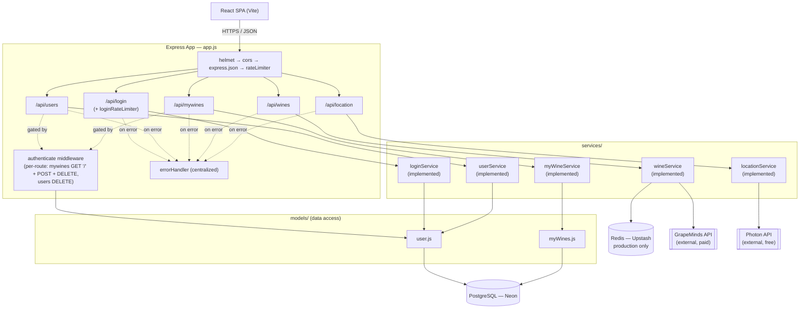
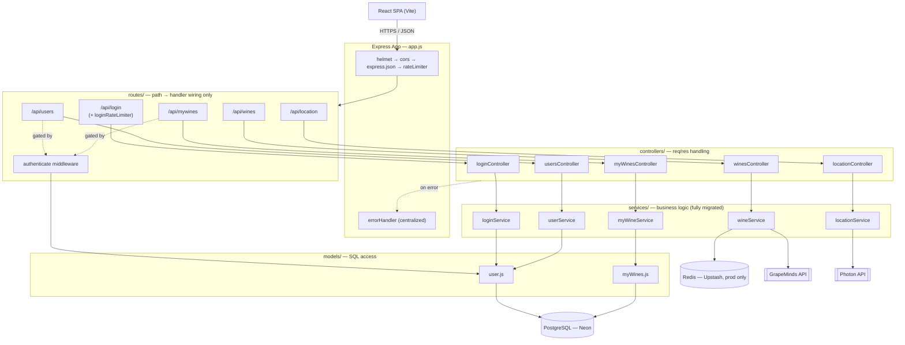
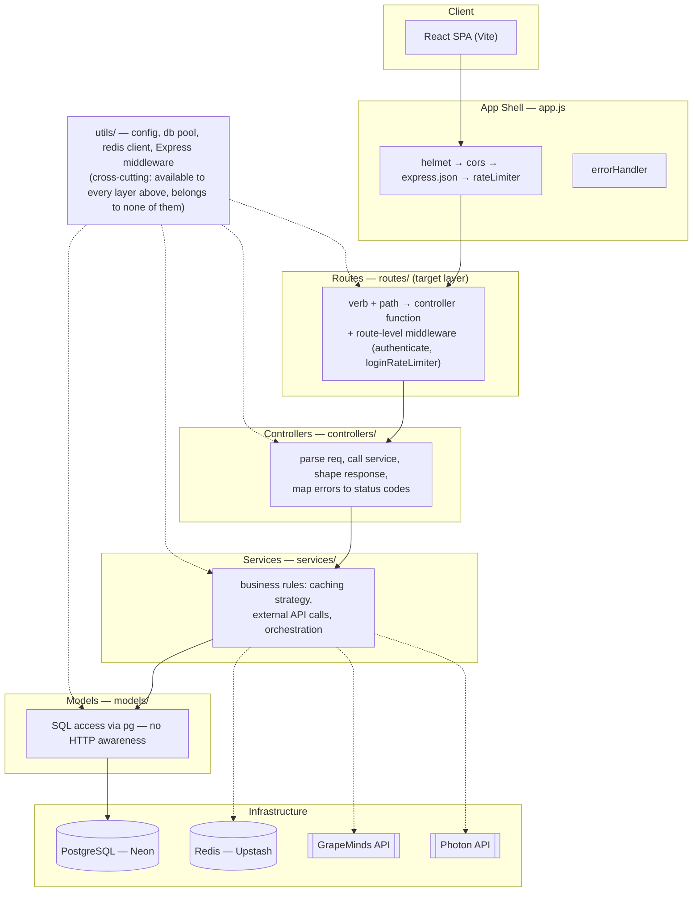
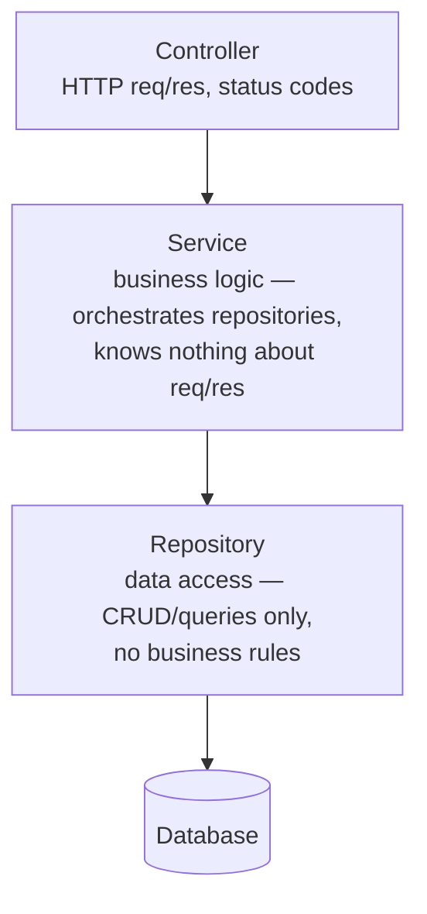
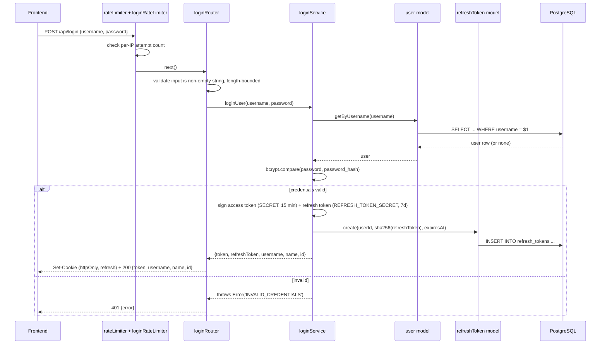
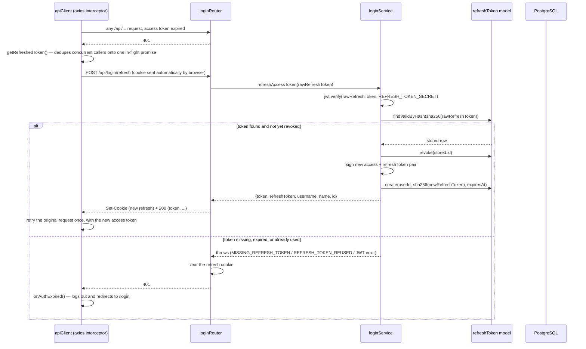
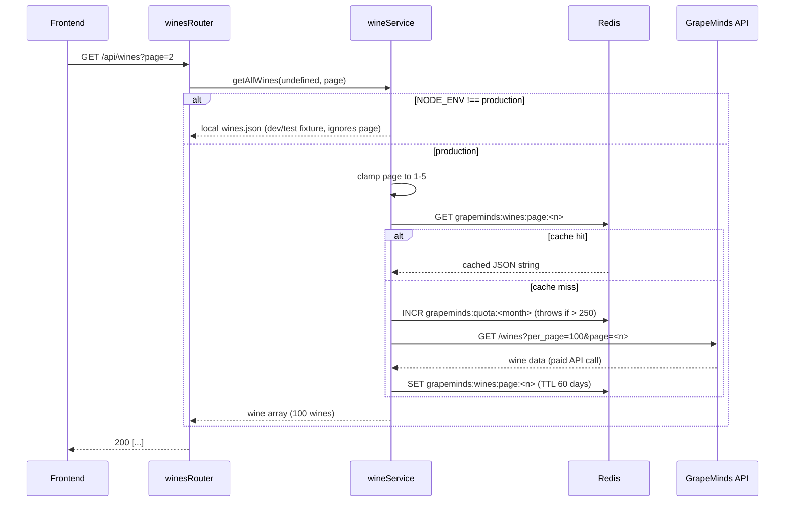
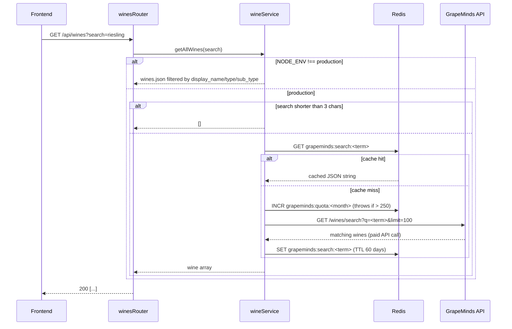
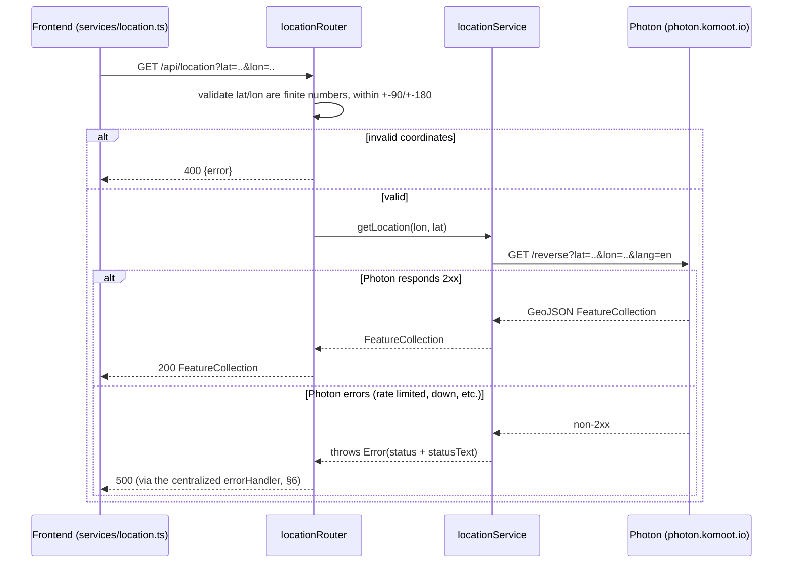

# KnowWine AI — Backend Architecture

## 1. Overview

The backend is a Node.js/Express REST API serving a React SPA. It owns three
concerns: user authentication, a user-curated wine list ("My Wines") backed
by PostgreSQL, and a browsable wine catalogue proxied and cached from a
third-party API (GrapeMinds).

|                      |                                                                                                       |
| -------------------- | ----------------------------------------------------------------------------------------------------- |
| Runtime              | Node.js, CommonJS                                                                                     |
| Framework            | Express 5                                                                                             |
| Primary datastore    | PostgreSQL (Neon, serverless)                                                                         |
| Cache                | Redis (Upstash), production only                                                                      |
| Auth                 | JWT access token (15 min) + rotating httpOnly refresh-token cookie (7 days) + bcrypt password hashing |
| External integration | GrapeMinds wine catalogue API, Photon reverse geocoding                                               |
| Security middleware  | Helmet (CSP), CORS, hand-rolled rate limiting                                                         |

## 2. High-Level Architecture

Dashed `-.gated by.->` arrows mark routes that run the shared `authenticate`
middleware (`utils/authenticate.js`) before their handler.

### 2.1 Target Architecture (Post-Refactor)

`controllers/` today actually holds Express `Router` objects (path + handler
wiring), not controller logic in the conventional sense — the two concerns
are merged into one file per domain. The target state separates them into a
dedicated `routes/` layer plus a `controllers/` layer of plain handler
functions. The service-layer split itself (routes/controllers → services →
models) is already complete for all four domains — see §3 — so this reshuffle
is purely about extracting routing out of `controllers/`, not about moving
business logic anywhere new:

The reshuffle is a pure code-organization change — since the test suite
(§`tests/`) drives everything through `supertest` against the assembled
`app`, it exercises routes/controllers/services identically either way and
needs no changes itself.

### 2.2 Layered View (Bottom-Up)

Same target architecture, drawn as a classic layer stack instead of a
per-domain graph — each band may only call downward into the band directly
beneath it, never sideways into another domain's internals or upward back
into a caller:

Reading bottom to top: **infrastructure** (Postgres/Redis/GrapeMinds/Photon) is
reached only through **models** (SQL) or directly from **services** for the
two external stores that aren't relational data; **services** hold all
business logic and never touch `req`/`res`; **controllers** are the only
layer allowed to read `req` or write `res`; **routes** just wire HTTP
verb+path combinations to a controller function plus any middleware; the
**app shell** applies process-wide middleware before any route matches.
`utils/` sits outside the stack — every layer may reach into it, but it
never reaches back up.

### 2.3 Simplified Controller–Service–Repository View

Stripped of KnowWine-specific detail (domains, external cache, middleware),
the same target architecture is a textbook instance of the
**Controller–Service–Repository (CSR) pattern** — a 3-tier layered
architecture where the data layer uses the Repository pattern:

| Layer      | Repo mapping                          | Rule                                    |
| ---------- | ------------------------------------- | --------------------------------------- |
| Controller | `controllers/`                        | Only layer that touches `req`/`res`     |
| Service    | `services/`                           | Only layer that contains business rules |
| Repository | `models/` — same role, different name | Only layer that writes SQL              |
| Database   | PostgreSQL                            | No logic — storage only                 |

`models/` in this codebase already _is_ the repository layer; naming it
`repositories/` instead is a cosmetic rename, not a structural change —
useful mainly if the team wants the more common cross-language vocabulary
(Java/C#/NestJS shops call this layer "repository", Node/Express projects
often say "model" for the same thing).

## 3. Layered Design

| Layer                                                                 | Responsibility                                                                                  | Should know about                        |
| --------------------------------------------------------------------- | ----------------------------------------------------------------------------------------------- | ---------------------------------------- |
| **Routes** (`routes/`, target — currently merged into `controllers/`) | Map HTTP verb + path → controller function, attach route-level middleware (e.g. `authenticate`) | Express routing only — no business logic |
| **Controllers** (`controllers/`)                                      | Parse `req`, call service/model, shape HTTP response, map errors to status codes                | Express, HTTP                            |
| **Services** (`services/`)                                            | Business rules: caching strategy, external API calls, orchestration across models               | Domain logic — nothing about `req`/`res` |
| **Models** (`models/`)                                                | Raw SQL access via `pg`                                                                         | SQL only                                 |
| **Utils** (`utils/`)                                                  | Cross-cutting: DB pool, Redis client, config, Express middleware                                | Infra                                    |

**Current state:** all four domains — **wines**, **mywines**, **login**, and
**users** — follow the service-layer split fully: their `controllers/`
routers delegate business logic (bcrypt hashing/comparison, JWT signing,
user-creation validation, caching strategy, GrapeMinds calls) to
`services/wineService.js`, `services/myWineService.js`,
`services/loginService.js`, and `services/userService.js` respectively.
Shared JWT verification has also been extracted out of the controllers
entirely into `utils/authenticate.js`, a route-level middleware reused by
both `mywines` and `users`. None of the four domains yet separate routing
from handler logic into `routes/` — see §2.1 for the target shape.

## 4. Request Lifecycle

Every request passes through this middleware chain, in order
(`app.js`):

1. `helmet()` — security headers + Content-Security-Policy (see §7)
2. `cors()` — origin locked to the frontend's own origin per environment
3. `express.json({ limit: '1mb' })` — body parsing, payload size cap
4. `rateLimiter` — global IP-based rate limit (50 req/15min in production, 500 in dev)
5. Route match (`/api/login`, `/api/users`, `/api/mywines`, `/api/wines`)
   - `/api/login` additionally passes through `loginRateLimiter`
     (8 attempts/15min in production) before the login handler — a
     tighter, brute-force-specific limit layered on top of the global one
6. `unknownEndpoint` — catches anything unmatched → 404
7. `errorHandler` — centralized error → status code mapping (see §6)

## 5. Domain Walkthrough

### 5.1 Authentication (`POST /api/login`, `/refresh`, `/logout`)

Login issues two tokens instead of one:

- **Access token** — JWT signed with `SECRET`, `ACCESS_TOKEN_TTL` (15 min by
  default). Returned in the JSON response body only. The frontend keeps it
  in memory (`apiClient.ts`, never `localStorage`) and sends it as
  `Authorization: Bearer <token>` on every request — a short TTL bounds how
  long a leaked access token stays useful.
- **Refresh token** — JWT signed with a _separate_ `REFRESH_TOKEN_SECRET`,
  `REFRESH_TOKEN_TTL` (7 days by default). Set as an `httpOnly`,
  `SameSite=Lax` cookie scoped to the `/api/login/refresh` path only, so
  client-side JS never sees it and it isn't sent on unrelated requests. Only
  its SHA-256 hash is persisted (`refresh_tokens` table) — the raw token
  itself is never stored server-side.

**Silent refresh, driven entirely by the frontend's axios interceptor**
(`apiClient.ts`) rather than a background timer — nothing calls `/refresh`
proactively; it fires reactively the first time a request meets an expired
access token:

**Rotation with reuse detection:** every refresh consumes the current
refresh token and issues a new one (`revoke` + `create` above), so a given
refresh token is only ever valid for a single `/refresh` call. If a token
that's already been revoked is presented again, that's treated as a signal
the token may have been stolen and replayed — every refresh token for that
user is revoked at once, forcing a full re-login on all sessions rather than
trusting the request. See [Known Issues §8](#8-known-issues--technical-debt)
for a legitimate false-positive case this causes (near-simultaneous refresh
from two tabs).

**Logout** (`POST /api/login/logout`) revokes only the current refresh
token by its hash and clears the cookie; it does not touch other sessions
for the same user.

Downstream routes (`/api/mywines` POST/DELETE, `/api/users` DELETE) verify
the access token with `jwt.verify` and re-fetch the user from the database
on every request — the token carries only `{ username, id }`, it is not
trusted for authorization decisions beyond identifying the user.

### 5.2 Wine catalogue — browsing (`GET /api/wines`)

GrapeMinds' real catalogue has ~264,700 wines across ~2,650 pages of 100; the app deliberately
never tries to mirror it — see §5.2's quota note and [ADR-002](../docs/adr.md#adr-002-bound-catalogue-browsing-to-5-pages-instead-of-full-pagination).

`page` is clamped server-side to **1–5** even if a client requests higher — browsing is bounded
deliberately, since paging through all ~2,650 real pages would exhaust the entire 250/month quota
on browsing alone (see §8 for the resolved issue this replaced). Each page is cached under its
own key so pages don't overwrite each other, and a near-simultaneous duplicate request for the
same uncached page shares one in-flight GrapeMinds call instead of firing two.

### 5.2b Wine catalogue — search (`GET /api/wines?search=`)

Unlike the old design, **search proxies to GrapeMinds' own `/wines/search` endpoint** rather than
filtering whatever catalogue page happens to be cached — this is what actually reaches the full
264k-wine catalogue instead of only the ≤500 wines ever cached for browsing. Search is cached
separately from the browsing pages (`grapeminds:search:<term>`, distinct Redis keys) since the two
serve different purposes and shouldn't invalidate each other.

### 5.2c Wine detail (`GET /api/wines/:id`)

Proxies to GrapeMinds' `GET /wines/:id`, cached per id (`grapeminds:wine:<id>`, 60-day TTL). 404s
are cached too (as `null`) so a bad or stale id doesn't cost quota on every repeat request — a
broken link or a bot hitting the same missing id repeatedly is otherwise indistinguishable from a
legitimate cache-miss traffic pattern. `getWineById` falls back to a local `wines.json` lookup in
dev/test, same as the other two paths.

### 5.3 My Wines (`/api/mywines`)

Standard authenticated CRUD over the `my_wines` table, scoped to the
requesting user (`user_id` foreign key). Deletes verify ownership
(`wine.user_id === user.id`) before allowing the operation — a user cannot
delete another user's entry even with a valid token.

### 5.4 Location — reverse geocoding (`GET /api/location`)

Unauthenticated. Resolves a `lat`/`lon` pair (the frontend's browser
geolocation coordinates — see `front/docs/ARCHITECTURE.md` §12 for the
client side) to a human-readable place name via
[Photon](https://photon.komoot.io/), an open-source, OpenStreetMap-based
geocoder. The backend calls Photon rather than letting the browser call it
directly, for two reasons: the CSP (§7) only allows same-origin and the
MapLibre demo tile host, so a direct browser→Photon call is blocked outright
in production; and routing it through the backend means the user's precise
coordinates never leave the browser for a third party the user hasn't been
told about.

No caching, no rate-limiting, and no API key — Photon's public instance is
free but shared and best-effort, so a burst of traffic can return `503`s
(observed in practice during development). This is the same class of risk
GrapeMinds posed before the Redis-backed quota system in
[`docs/adr.md`](../docs/adr.md) ADR-002 — worth revisiting the same way if
usage here ever grows past casual/demo traffic.

## 6. Error Handling

All routes funnel unexpected errors to `next(error)`, handled centrally by
`errorHandler` (`utils/middleware.js`):

| Condition                           | Response                                                              |
| ----------------------------------- | --------------------------------------------------------------------- |
| Malformed JSON body                 | `400 Invalid JSON`                                                    |
| Postgres unique violation (`23505`) | `400 name must be unique`                                             |
| Invalid/expired JWT                 | `401 token invalid` / `401 token expired`                             |
| Anything else                       | `500 Internal server error` (generic message — no stack trace leaked) |

## 7. Security Posture

- **Helmet + CSP**: default directives plus two explicit relaxations —
  `worker-src blob:` (maplibre-gl parses map tiles in a blob worker) and
  `connect-src https://demotiles.maplibre.org` (map demo tiles). Any future
  third-party asset needs an explicit CSP allowance here, not a blanket
  `unsafe-inline`/`*`.
- **`trust proxy`**: set to `1` (trust exactly one hop) in production, `false`
  otherwise. Trusting the whole `X-Forwarded-For` chain would let a client
  spoof `req.ip` and bypass IP-keyed rate limiting entirely.
- **Rate limiting**: in-memory, per-process (`utils/middleware.js`). Two
  tiers — global (50/15min) and login-specific (8/15min). This is
  brute-force mitigation, **not** DDoS protection — a distributed attack
  spread across many IPs is not slowed by a per-IP counter, and true
  volumetric protection belongs at the CDN/edge layer, not here.
- **Passwords**: bcrypt, cost factor 10, never logged or returned in any
  response payload.
- **CORS**: locked to a single explicit origin per environment, not a
  wildcard.
- **Refresh token rotation + reuse detection** (§5.1): the refresh cookie is
  `httpOnly`/`SameSite=Lax`, path-scoped to `/api/login/refresh`, and only
  ever stored server-side as a SHA-256 hash. Each refresh consumes and
  replaces the token; a replayed (already-consumed) token revokes every
  refresh token for that user as a precaution against a stolen token.
- **Access token never persisted client-side**: `apiClient.ts` keeps it in a
  module-level JS variable, not `localStorage`/`sessionStorage` — an XSS
  payload that can run JS can still steal it for its 15-minute lifetime, but
  it can't read it out of storage after the fact or across page reloads.

## 8. Known Issues & Technical Debt

Ordered by severity — this is the section to work through next. No High-severity
issues are currently outstanding.

### Resolved

1. ~~**Service layer was partially migrated.**~~ **Resolved.**
   `services/loginService.js` and `userService.js` are now fully implemented
   — `controllers/login.js` and `users.js` delegate to them instead of
   containing JWT signing, bcrypt, and validation logic inline. All four
   domains (`wines`, `mywines`, `login`, `users`) now follow the same
   controller → service → model split.

2. ~~**External catalogue pagination is hardcoded to page 1.**~~ **Resolved.**
   Browsing now covers pages 1–5 (clamped server-side, see §5.2) instead of
   only page 1, and search (§5.2b) proxies to GrapeMinds' own
   `/wines/search` endpoint instead of filtering the cached browsing pages
   — it reaches the full catalogue, not just whatever's cached for
   browsing. Full, unbounded pagination through GrapeMinds' ~2,650 real
   pages remains an explicit non-goal — see
   [ADR-002](../docs/adr.md#adr-002-bound-catalogue-browsing-to-5-pages-instead-of-full-pagination).

### Medium

3. **No ORM, query builder, or migration tool.** Schema is created ad-hoc
   via `CREATE TABLE IF NOT EXISTS` in `utils/db.js#initDb()` on every
   startup. There is no versioned migration history and no rollback path —
   a destructive schema change today has no safety net. Decision on the
   replacement tool: see [ADR-001](../docs/adr.md#adr-001-adopt-drizzle-orm-for-schema-migrations-and-query-building).

4. **`express-rate-limit` is installed but unused.** `utils/middleware.js`
   still has hand-rolled, in-memory, per-process rate limiters instead.
   Worth a deliberate decision: adopt the library and delete the hand-rolled
   code, or remove the unused dependency.

   `express-validator` is no longer in this category — it now backs the
   `POST` body validation in `controllers/users.js`
   (`createUserValidation`) and `controllers/mywines.js`
   (`createWineValidation`), including explicit `.isString()` checks so a
   non-string field (number, object, boolean) is rejected with a `400`
   instead of being silently coerced to a string and stored. Still on the
   old hand-rolled pattern: `controllers/login.js` (manual `isValid` check)
   and every `:id` route param (`Number(req.params.id)` +
   `Number.isNaN` in both `users.js` and `mywines.js`) — those should move
   to `body()`/`param()` validators too for consistency.

5. **Refresh-token reuse detection has a multi-tab false-positive case**
   (§5.1). Two tabs of the same origin share one refresh cookie but each
   holds its own in-memory access token. If both tabs' access tokens expire
   close enough together that both fire `/refresh` before either response
   lands, the second request presents a refresh token the first already
   rotated away — indistinguishable, server-side, from a genuine replay —
   so reuse detection revokes every token for that user and force-logs-out
   both tabs. Two fixes considered, neither implemented yet: a short grace
   period in `refreshAccessToken` that treats a just-rotated token as
   benign if its replacement is still valid, or coordinating refresh calls
   across tabs client-side (e.g. `BroadcastChannel`) so only one actually
   hits the network. The grace-period approach is preferred — it fixes the
   race for any client, not just this frontend.

6. **`GET /api/location` has no caching, no rate-limiting, and depends on
   an unkeyed public API with no SLA** (§5.4). Photon's public instance
   has already been observed returning `503`s during development — the
   route has no fallback beyond surfacing the error to the frontend. Fine
   at current traffic; see
   [ADR-003](../docs/adr.md#adr-003-use-photon-for-reverse-geocoding-unkeyed-and-uncached)
   for the tradeoff and the shape of the fix (a Redis cache keyed on
   rounded coordinates, mirroring ADR-002's quota system) if this ever
   needs to be more reliable.

## 9. Recommended Next Steps

1. Adopt Drizzle ORM + `drizzle-kit` (see [ADR-001](../docs/adr.md#adr-001-adopt-drizzle-orm-for-schema-migrations-and-query-building))
   before the schema changes again; folding new `ALTER TABLE` statements
   into `initDb()` indefinitely does not scale.
2. Finish the `express-validator` migration: convert `controllers/login.js`
   to a `body()` validation chain (matching `users.js`/`mywines.js`), and
   replace the repeated manual `Number(req.params.id)` / `Number.isNaN`
   checks with a shared `param('id').isInt()` validator reused across both
   controllers.
3. Split `routes/` out of `controllers/` per the target architecture in
   §2.1 — each domain's `Router` wiring moves to `routes/<domain>.js`,
   leaving `controllers/<domain>Controller.js` as plain handler functions.
   Since the service layer is already fully migrated (§8), this is now a
   pure routing extraction with no business logic to move alongside it.
4. If usage ever grows enough that 5 cached browsing pages + on-demand
   search feels limiting, revisit [ADR-002](../docs/adr.md#adr-002-bound-catalogue-browsing-to-5-pages-instead-of-full-pagination)
   — e.g. a slow background job that persists a handful of new pages per
   day, well under the 250/month quota, rather than raising the bound
   naively.

## 10. Architecture Decision Records (ADRs)

Architecture decisions for this project (both `back/` and `front/`) are
logged centrally in **[`docs/adr.md`](../docs/adr.md)**, not in this file —
see that file for the two current entries (**ADR-001**: Drizzle ORM
adoption; **ADR-002**: the 5-page catalogue browsing cap) and for the
process/format to follow when adding a new one.
