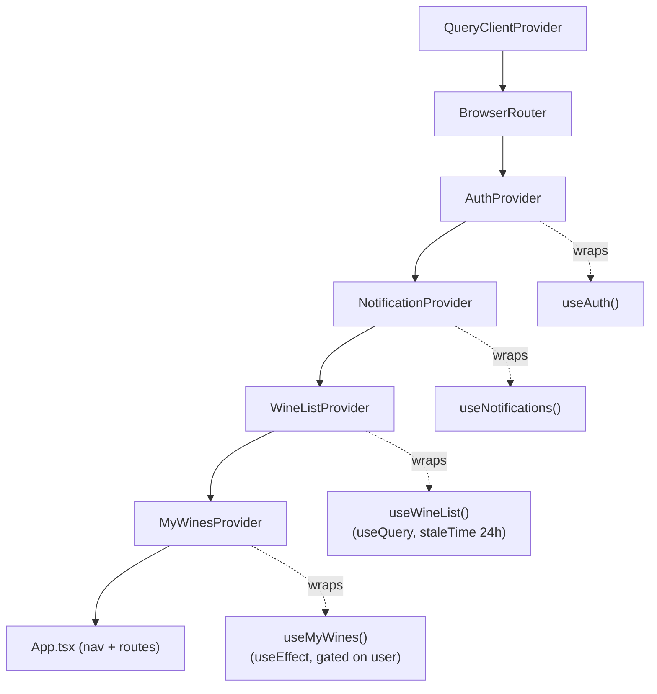
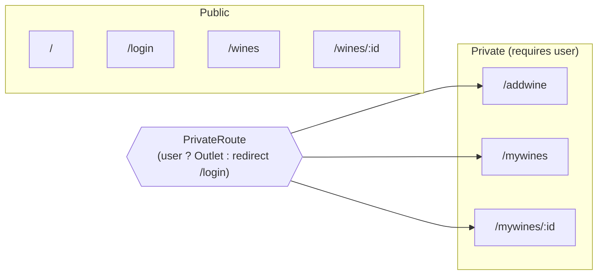
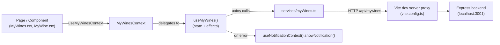
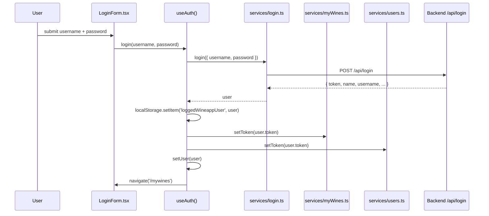
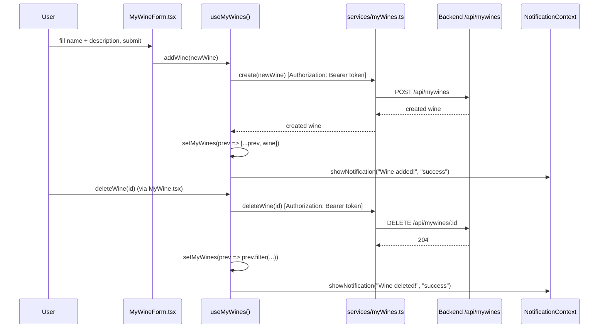

# KnowWine AI — Frontend Architecture

This document describes the structure of the `front/` application: how it's composed, how
state flows, and how it talks to the backend. Diagrams are written in [Mermaid](https://mermaid.js.org/)
and render automatically on GitHub/GitLab.

## 1. Tech stack

| Concern            | Choice                                    |
|---------------------|--------------------------------------------|
| UI framework        | React 19 + TypeScript                      |
| Build tool           | Vite 8                                     |
| Routing              | react-router-dom v7                        |
| HTTP client          | axios                                      |
| Server-state / caching | TanStack Query (`@tanstack/react-query`) |
| Component library    | MUI (`@mui/material`, `@mui/icons-material`) |
| Map rendering        | maplibre-gl (globe on the Home page)       |
| Unit / component tests | Vitest + Testing Library                 |
| E2E tests            | Playwright                                 |
| Linting / formatting | ESLint (typescript-eslint) + Prettier      |

State management is intentionally lightweight: no Redux/Zustand — just React Context wrapping
custom hooks.

## 2. Directory layout

```
front/src
├── main.tsx                 # entry point — mounts Router + all context Providers
├── App.tsx                  # top nav, route table
├── context/                 # React Context wrappers (one per domain)
│   ├── AuthContext.tsx
│   ├── MyWinesContext.tsx
│   ├── NotificationContext.tsx
│   └── WineListContext.tsx
├── hooks/                    # the actual state + logic behind each context
│   ├── useAuth.ts
│   ├── useMyWines.ts
│   ├── useNotifications.ts
│   └── useWineList.ts
├── services/                  # axios wrappers, one per backend REST resource
│   ├── login.ts               #   /api/login
│   ├── myWines.ts              #   /api/mywines
│   ├── users.ts                 #   /api/users
│   └── wineList.ts               #   /api/wines
├── types/                        # shared TypeScript types, decoupled from any one layer
│   └── wine.ts                    #   Wine, Producer — used by hooks, pages, and components alike
├── pages/                       # route-level screens
│   ├── Home.tsx
│   ├── LoginForm.tsx
│   ├── MyWineForm.tsx
│   ├── MyWines.tsx
│   └── WineList.tsx
└── components/                  # reusable / presentational pieces
    ├── common/                    # domain-agnostic — no wine/auth knowledge, safe to use anywhere
    │   ├── Footer.tsx
    │   ├── Notification.tsx
    │   └── Togglable.tsx
    ├── MyWine.tsx                 # still domain-specific, but a "component" like any other
    ├── PrivateRoute.tsx
    ├── WineCard.tsx
    ├── WineDetail.tsx
    └── WineVisualization.tsx      # currently unused — not imported by any page or route
```

**On the structure itself:** this is approximately a **type-based layout** — folders are named
after what *kind* of file lives in them (`context/`, `hooks/`, `services/`, `pages/`,
`components/`), not after a domain like `wines/` or `auth/`. That's a deliberate,
size-appropriate choice: at ~30 source files.


## 3. Composition root — provider tree

`main.tsx` nests every context provider around `<App />`, with `QueryClientProvider` as the
outermost wrapper — it must sit above every provider whose hook calls `useQuery` (currently just
`WineListProvider`). Order matters below that too: `AuthProvider` must wrap everything that needs
`user` (including `MyWinesProvider`, whose `useMyWines` now skips fetching until a user is
logged in), and `MyWinesProvider` sits inside `WineListProvider` and `NotificationProvider`
because `useMyWines` calls both `useAuthContext()` and `useNotificationContext()` internally.



Each `*Context.tsx` follows the same pattern: it has no state of its own, it just runs the
matching hook once and exposes the result via `createContext` + a `useXContext()` accessor that
throws if called outside its provider. This keeps the context's type inferred from the hook, so
they can't drift apart.

## 4. Route map



`PrivateRoute` (`components/PrivateRoute.tsx`) is a layout route: it renders
`<Outlet />` when `user` is truthy, otherwise it redirects. `App.tsx` reads `user` from
`useAuthContext()` and passes it in, and also toggles which nav buttons are shown.

## 5. Data flow (Component → Context → Hook → Service → API)

Every domain follows the same four-layer flow. Example for wines a user has saved:



In dev, `vite.config.ts` proxies `/api/*` to `http://localhost:3001`, so the frontend and
backend can run on separate ports without CORS configuration.

`useMyWines` (and every other hook except `useWineList`) still owns its fetch manually via
`useState`/`useEffect`. `useWineList` is the one exception — it fetches through TanStack Query's
`useQuery` instead, which is why it's the only hook not calling `useState` for its data. See
§11 for the wine-search flow, which uses a second, independent `useQuery` call scoped to the
search page rather than the shared `WineListContext`.

## 6. Sequence: login



On mount, `useAuth`'s effect reads `loggedWineappUser` back out of `localStorage` and re-applies
the token to `myWineService` and `userService`, so a page refresh doesn't lose the session.

## 7. Sequence: add / delete a wine



**Note on auth headers:** `services/myWines.ts` attaches the `Authorization` header on all four
operations (`getAll`, `create`, `update`, `deleteWine`). `getAll` previously sent no auth header
at all, which combined with `MyWinesProvider` fetching unconditionally on app mount to produce a
guaranteed `401` (and an "Unable to load myWines" toast) for every logged-out visitor — both are
now fixed: `getAll` sends the token, and `useMyWines`'s fetch effect is gated on `user` from
`useAuthContext()`, only firing once a session actually exists.

## 8. Component inventory

| Component | Role | Notable props |
|---|---|---|
| `App.tsx` | Top-level layout: nav bar, `<Routes>` table, wires all contexts together | — |
| `pages/Home.tsx` | Landing page; renders a MapLibre GL globe | — |
| `pages/LoginForm.tsx` | Username/password form, calls `useAuthContext().login` | — |
| `pages/WineList.tsx` | Debounced, backend-filtered search (own `useQuery`, §11) + MUI table over the full wine catalogue (`/wines`) | `wineList`, `isLoading` |
| `pages/MyWines.tsx` | Search + list over the signed-in user's saved wines (`/mywines`) | — |
| `pages/MyWineForm.tsx` | Form to add a wine to "my wines" (`/addwine`) | `addWine` |
| `components/MyWine.tsx` | Single saved-wine detail row + delete button (route target for `/mywines/:id`) | `wine`, `id` |
| `components/WineCard.tsx` | Compact table row for one catalogue wine, links to its detail page | `wine` |
| `components/WineDetail.tsx` | Full single-wine detail view (route target for `/wines/:id`) — shows type, subtype, color, residual sugar, producer, region | `wine` |
| `components/PrivateRoute.tsx` | Route guard — redirects unauthenticated users | `user`, `redirectPath` |
| `components/common/Notification.tsx` | Renders the current toast from `NotificationContext` as an MUI `Alert` | `notification` |
| `components/common/Togglable.tsx` | Generic show/hide wrapper (button ↔ children) | `buttonLabel`, `children` |
| `components/WineVisualization.tsx` | Decorative animated SVG wine glass — currently unused, not wired into any page | — |
| `components/common/Footer.tsx` | Static site footer | — |

## 9. Testing

- **Unit / component** (`front/tests/*.test.jsx`, Vitest + Testing Library): currently covers
  `MyWine` and `MyWineForm`.
- **E2E** (`front/e2e/*.spec.ts`, Playwright): `app.spec.ts`, `home.spec.ts`, `wines.spec.ts`
  drive the app through a real browser against the dev server + backend.

Run with:

```bash
npm run test        # vitest
npm run test:e2e     # playwright
```

## 10. Known rough edges (from the current code)

These aren't hidden — they're either TODOs already in the source or asymmetries worth knowing
about before extending the app:

- `pages/MyWineForm.tsx`: the new wine's `id` is a hardcoded placeholder (`1 + 1`) rather than
  server-assigned — relies on the backend response overwriting it via `addWine`'s `.then`.
- `App.tsx` has TODOs for preventing duplicate wines and for a "favourites" flow.
- `pages/MyWines.tsx` has commented-out filters for wine type/region/grape that aren't wired up
  yet.
- Wine search (§11) only searches the backend's already-cached ≤100-wine catalogue — it doesn't
  reach wines beyond GrapeMinds' hardcoded page 1 (see `back/README.md` §8 Known Issues #2).

## 11. Sequence: wine catalogue search

Unlike the full catalogue (`useWineList`, shared via `WineListContext`), search results are
fetched by a second, independent `useQuery` local to `pages/WineList.tsx` — the shared
`wineList` (used by the table on the same page, and by `App.tsx` for `/wines/:id` lookups) is
never filtered client-side or replaced by the search query.

```mermaid
sequenceDiagram
    participant U as User
    participant WL as WineList.tsx
    participant RQ as TanStack Query
    participant Svc as services/wineList.ts
    participant API as Backend GET /api/wines

    U->>WL: types into search input
    WL->>WL: setSearched(value)
    WL->>WL: 300ms debounce → setDebouncedSearch(value)
    alt debouncedSearch.trim().length >= 2
        WL->>RQ: useQuery({ queryKey: ['wines','search',debouncedSearch], enabled: true })
        RQ->>Svc: searchAll(debouncedSearch)  [cache miss for this term]
        Svc->>API: GET /api/wines?search=<term>
        API-->>Svc: filtered wine array (filtered server-side, see back/README.md §5.2)
        Svc-->>RQ: wine array
        RQ-->>WL: data → filteredWines
    else fewer than 2 characters
        WL->>RQ: useQuery({ ..., enabled: false })
        Note over RQ: query does not fire; filteredWines stays []
    end
    WL->>U: renders "Search Results" list from filteredWines
```

Because `debouncedSearch` is part of the `queryKey`, TanStack Query treats each distinct search
term as its own cache entry — re-searching a term already seen in this session returns instantly
from cache instead of re-hitting the backend. `enabled` (not a client-side early return) is what
suppresses the request for 0–1 character input, so no network call happens until the 2-character
threshold is met.
