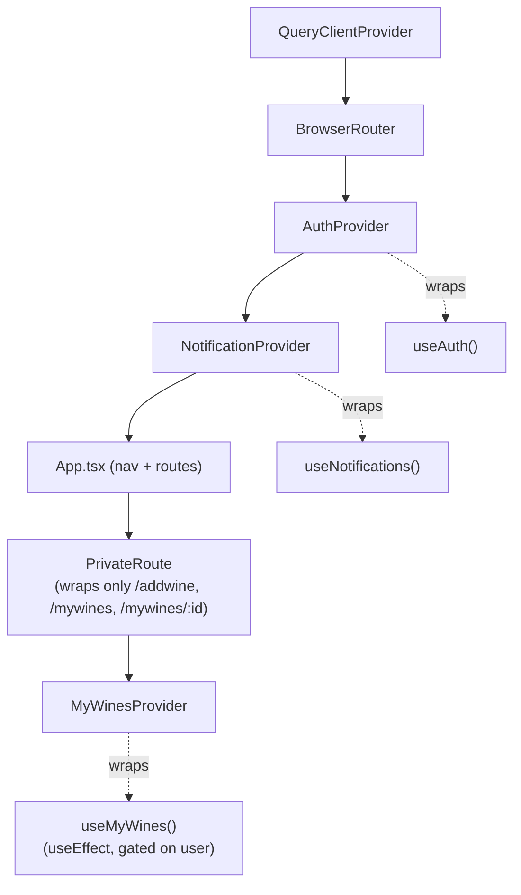
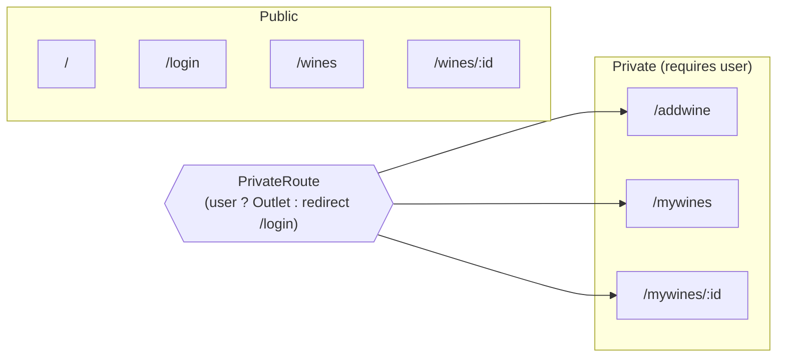
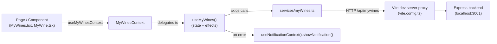
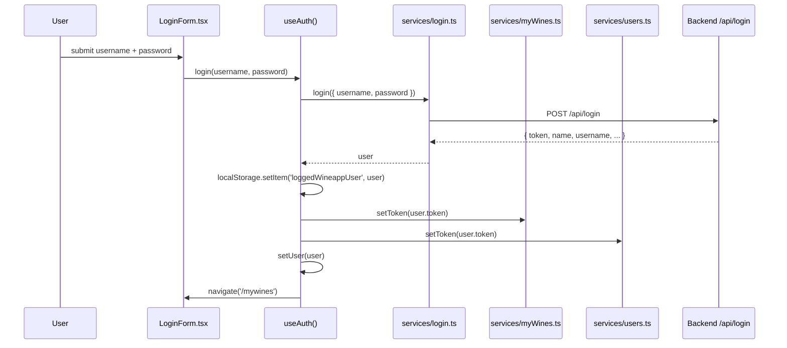
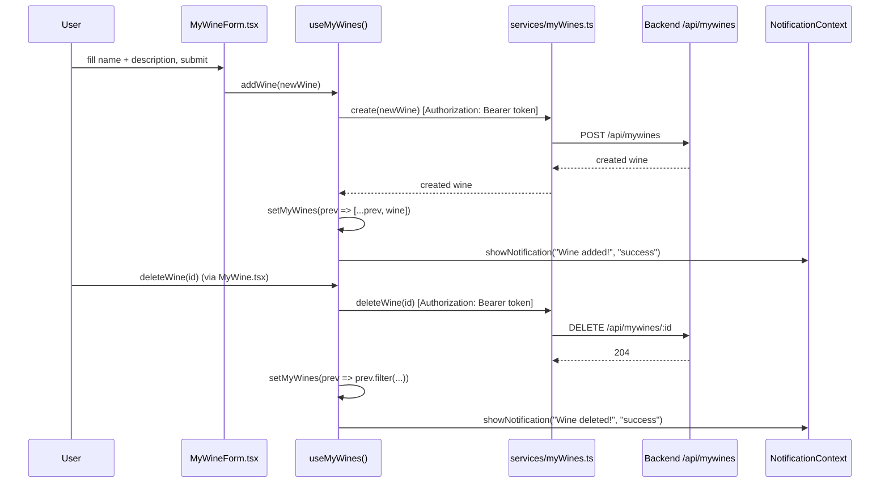
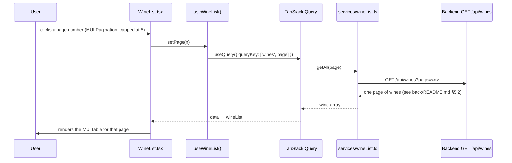

# KnowWine AI — Frontend Architecture

This document describes the structure of the `front/` application: how it's composed, how
state flows, and how it talks to the backend. Diagrams are written in [Mermaid](https://mermaid.js.org/)
and render automatically on GitHub/GitLab.

## 1. Tech stack

| Concern                | Choice                                       |
| ---------------------- | -------------------------------------------- |
| UI framework           | React 19 + TypeScript                        |
| Build tool             | Vite 8                                       |
| Routing                | react-router-dom v7                          |
| HTTP client            | axios                                        |
| Server-state / caching | TanStack Query (`@tanstack/react-query`)     |
| Component library      | MUI (`@mui/material`, `@mui/icons-material`) |
| Map rendering          | maplibre-gl (globe on the Home page)         |
| Unit / component tests | Vitest + Testing Library                     |
| E2E tests              | Playwright                                   |
| Linting / formatting   | ESLint (typescript-eslint) + Prettier        |

State management is intentionally lightweight: no Redux/Zustand — just React Context wrapping
custom hooks.

## 2. Directory layout

```
front/src
├── main.tsx                 # entry point — mounts Router + all context Providers
├── App.tsx                  # top nav, route table
├── context/                 # React Context wrappers (only where state has 2+ consumers)
│   ├── AuthContext.tsx
│   ├── MyWinesContext.tsx
│   └── NotificationContext.tsx
├── hooks/                    # the actual state + logic behind each context
│   ├── useAuth.ts
│   ├── useLocation.ts        # user's browser geolocation + reverse-geocoded place name, see §12
│   ├── useMyWines.ts
│   ├── useMyWineSearch.ts    # search/filter over the signed-in user's own wines (no debounce — in-memory, free)
│   ├── useNotifications.ts
│   ├── useWineList.ts        # paginated catalogue browsing (page 1-5, see §11)
│   ├── useWineSearch.ts      # submit-triggered catalogue search (see §11)
│   └── wineQueryConfig.ts    # shared TanStack Query staleTime/gcTime for wine data (60 days)
├── services/                  # axios wrappers, one per backend REST resource
│   ├── login.ts               #   /api/login
│   ├── location.ts             #   /api/location (reverse geocoding, see §12)
│   ├── myWines.ts              #   /api/mywines
│   ├── users.ts                 #   /api/users
│   └── wineList.ts               #   /api/wines, /api/wines/:id
├── types/                        # shared TypeScript types, decoupled from any one layer
│   └── wine.ts                    #   Wine, Producer, MyWine, WineSearchResult — used by hooks, pages, and components alike
├── pages/                       # route-level screens
│   ├── Home.tsx
│   ├── LoginForm.tsx
│   ├── MyWineForm.tsx
│   ├── MyWines.tsx
│   └── WineList.tsx
└── components/                  # reusable / presentational pieces
    ├── common/                    # domain-agnostic — no wine/auth knowledge, safe to use anywhere
    │   ├── Footer.tsx
    │   ├── Notification.tsx
    │   ├── SearchList.tsx         # shared search box + results list, used by both WineList and MyWines
    │   └── Togglable.tsx
    ├── MyWine.tsx                 # still domain-specific, but a "component" like any other
    ├── PrivateRoute.tsx
    ├── WineCard.tsx
    ├── WineDetail.tsx             # fetches its own wine by id (GET /api/wines/:id) — not read from useWineList's cache
    └── WineVisualization.tsx      # currently unused — not imported by any page or route
```

**On the structure itself:** this is approximately a **type-based layout** — folders are named
after what _kind_ of file lives in them (`context/`, `hooks/`, `services/`, `pages/`,
`components/`), not after a domain like `wines/` or `auth/`. That's a deliberate,
size-appropriate choice: at ~30 source files.

## 3. Composition root — provider tree

`main.tsx` nests `AuthProvider` and `NotificationProvider` around `<App />`, with
`QueryClientProvider` as the outermost wrapper — it must sit above every component whose hook
calls `useQuery` (`useWineList`, and any `useQuery` call inside `App`'s tree). `MyWinesProvider`
is _not_ mounted here: it's mounted lower, in `PrivateRoute.tsx` (see §4), wrapping only the
routes that actually need it. Order matters: `AuthProvider` must wrap everything that needs
`user` (including, transitively, `MyWinesProvider` further down, since `useMyWines` now skips
fetching until a user is logged in), and `MyWinesProvider` sits inside `NotificationProvider`
because `useMyWines` calls both `useAuthContext()` and `useNotificationContext()` internally.



Each `*Context.tsx` follows the same pattern: it has no state of its own, it just runs the
matching hook once and exposes the result via `createContext` + a `useXContext()` accessor that
throws if called outside its provider. This keeps the context's type inferred from the hook, so
they can't drift apart. `useWineList` deliberately doesn't get this treatment — `pages/WineList.tsx`
is its only consumer, so it's called directly there (see §11) rather than wrapped in a provider
that would otherwise fetch on every app load regardless of whether the user ever visits `/wines`.

## 4. Route map



`PrivateRoute` (`components/PrivateRoute.tsx`) is a layout route: it renders
`<Outlet />` when `user` is truthy, otherwise it redirects. `App.tsx` reads `user` from
`useAuthContext()` and passes it in, and also toggles which nav buttons are shown.

## 5. Data flow (Component → Context → Hook → Service → API)

Every domain follows the same four-layer flow. Example for wines a user has saved:



In dev, `vite.config.ts` proxies `/api/*` to `http://localhost:3001`, so the frontend and
backend can run on separate ports without CORS configuration.

`useMyWines` (and every other hook except `useWineList`) still owns its fetch manually via
`useState`/`useEffect`. `useWineList` is the one exception — it fetches through TanStack Query's
`useQuery` instead, which is why it's the only hook not calling `useState` for its data. See
§11 for the wine-search flow, which uses a second, independent `useQuery` call scoped to the
search page rather than the paginated catalogue held by `useWineList`.

## 6. Sequence: login



On mount, `useAuth`'s effect reads `loggedWineappUser` back out of `localStorage` and re-applies
the token to `myWineService` and `userService`, so a page refresh doesn't lose the session.

## 7. Sequence: add / delete a wine



**Note on auth headers:** `services/myWines.ts` attaches the `Authorization` header on all four
operations (`getAll`, `create`, `update`, `deleteWine`). `getAll` previously sent no auth header
at all, which combined with `MyWinesProvider` fetching unconditionally on app mount to produce a
guaranteed `401` (and an "Unable to load myWines" toast) for every logged-out visitor — both are
now fixed: `getAll` sends the token, and `useMyWines`'s fetch effect is gated on `user` from
`useAuthContext()`, only firing once a session actually exists.

## 8. Component inventory

| Component                            | Role                                                                                                                                                                                        | Notable props                                                          |
| ------------------------------------ | ------------------------------------------------------------------------------------------------------------------------------------------------------------------------------------------- | ---------------------------------------------------------------------- |
| `App.tsx`                            | Top-level layout: nav bar, `<Routes>` table, wires all contexts together                                                                                                                    | —                                                                      |
| `pages/Home.tsx`                     | Landing page; renders a MapLibre GL globe, flies to the user's browser location (`useLocation`, §12) and shows the reverse-geocoded place name                                              | —                                                                      |
| `pages/LoginForm.tsx`                | Username/password form, calls `useAuthContext().login`                                                                                                                                      | —                                                                      |
| `pages/WineList.tsx`                 | Submit-triggered catalogue search (`useWineSearch`, §11) via `SearchList` + paginated MUI table (`useWineList`, pages 1-5) over the wine catalogue (`/wines`)                               | `wineList`, `isLoading`, `page`                                        |
| `pages/MyWines.tsx`                  | Live in-memory search (`useMyWineSearch`) via `SearchList` + list over the signed-in user's saved wines (`/mywines`)                                                                        | —                                                                      |
| `pages/MyWineForm.tsx`               | Form to add a wine to "my wines" (`/addwine`)                                                                                                                                               | `addWine`                                                              |
| `components/MyWine.tsx`              | Single saved-wine detail row + delete button (route target for `/mywines/:id`)                                                                                                              | `wine`, `id`                                                           |
| `components/WineCard.tsx`            | Compact table row for one catalogue wine, links to its detail page                                                                                                                          | `wine`                                                                 |
| `components/WineDetail.tsx`          | Full single-wine detail view (route target for `/wines/:id`) — fetches its own data by id via `GET /api/wines/:id`, shows type, subtype, color, residual sugar, producer, region            | — (reads `id` from the route)                                          |
| `components/PrivateRoute.tsx`        | Route guard — redirects unauthenticated users                                                                                                                                               | `user`, `redirectPath`                                                 |
| `components/common/SearchList.tsx`   | Generic search box + results list + empty state; shared between `WineList` and `MyWines`. Live-filter by default, or submit-only (`<form>`, Enter/button) when an `onSubmit` prop is passed | `searchTerm`, `results`, `itemKey`/`itemHref`/`itemLabel`, `onSubmit?` |
| `components/common/Notification.tsx` | Renders the current toast from `NotificationContext` as an MUI `Alert`                                                                                                                      | `notification`                                                         |
| `components/common/Togglable.tsx`    | Generic show/hide wrapper (button ↔ children)                                                                                                                                               | `buttonLabel`, `children`                                              |
| `components/WineVisualization.tsx`   | Decorative animated SVG wine glass — currently unused, not wired into any page                                                                                                              | —                                                                      |
| `components/common/Footer.tsx`       | Static site footer                                                                                                                                                                          | —                                                                      |

## 9. Testing

- **Unit / component** (`front/tests/*.test.jsx`, Vitest + Testing Library): currently covers
  `MyWine` and `MyWineForm`.
- **E2E** (`front/e2e/*.spec.ts`, Playwright): `app.spec.ts`, `home.spec.ts`, `wines.spec.ts`
  drive the app through a real browser against the dev server + backend. `home.spec.ts` only
  asserts the `h1` is visible — the geolocation/reverse-geocoding feature (§12) has no coverage
  at all: granted, denied, and Photon-failure paths are all currently unverified by any test.

Run with:

```bash
npm run test        # vitest
npm run test:e2e     # playwright
```

## 10. Known rough edges (from the current code)

These aren't hidden — they're either TODOs already in the source or asymmetries worth knowing
about before extending the app:

- `pages/MyWineForm.tsx`: the new wine's `id` is a hardcoded placeholder (`1 + 1`) rather than
  server-assigned — relies on the backend response overwriting it via `addWine`'s `.then`.
- `App.tsx` has TODOs for preventing duplicate wines and for a "favourites" flow.
- `pages/MyWines.tsx` has commented-out filters for wine type/region/grape that aren't wired up
  yet.
- Catalogue browsing (`useWineList`, §11) is capped at 5 pages (500 of GrapeMinds' ~264,700
  wines) — a deliberate bound given GrapeMinds' 250-request/month quota, not a bug. Search (§11)
  reaches the full catalogue instead; see `back/README.md` §5.2/§5.2b and
  [`docs/adr.md`](../../docs/adr.md) ADR-002.
- `services/location.ts` (§12) calls `axios` directly instead of the shared `apiClient`
  (`services/apiClient.ts`) that every other service uses. It happens to work because the
  `/api/location` route needs no auth header, but it's inconsistent with the rest of the
  codebase's convention — worth migrating to `apiClient` if this file is touched again.
- No caching or rate-limiting on `GET /api/location` (§12, `back/README.md` §5.4) — every mount
  of `Home.tsx` re-hits Photon's public, rate-limited instance. GrapeMinds got a Redis-backed
  quota system after hitting this exact problem (`docs/adr.md` ADR-002's context); the same
  pattern would apply here if usage ever grows past casual/demo traffic.

## 11. Sequence: wine catalogue browsing & search

The catalogue table and the search box are two independent data sources on the same page
(`pages/WineList.tsx`) — browsing comes from `useWineList()`, called directly since this page is
its only consumer, and search comes from a page-local `useWineSearch()`. Neither one filters or
replaces the other's data.

### 11.1 Browsing (paginated)



### 11.2 Search (submit-triggered, not live-as-you-type)

```mermaid
sequenceDiagram
    participant U as User
    participant SL as SearchList.tsx
    participant Hook as useWineSearch()
    participant RQ as TanStack Query
    participant Svc as services/wineList.ts
    participant API as Backend GET /api/wines?search=

    U->>SL: types into search input
    SL->>Hook: setSearchTerm(value)
    Note over SL: input value updates live; no query fires yet
    U->>SL: presses Enter / clicks Search (form submit)
    SL->>Hook: submitSearch()
    Hook->>Hook: setSubmittedSearch(searchTerm.trim())
    alt submittedSearch.length >= 3
        Hook->>RQ: useQuery({ queryKey: ['wines','search',submittedSearch], enabled: true })
        RQ->>Svc: searchAll(submittedSearch)  [cache miss for this term]
        Svc->>API: GET /api/wines?search=<term>
        API-->>Svc: wines from GrapeMinds' own /wines/search (see back/README.md §5.2b)
        Svc-->>RQ: wine array
        RQ-->>Hook: data → searchResults
    else fewer than 3 characters
        Hook->>RQ: useQuery({ ..., enabled: false })
        Note over RQ: query does not fire; searchResults stays []
    end
    Hook-->>SL: searchResults, hasSearched
    SL->>U: renders "Search Results" list (or the empty-state message if hasSearched && no results)
```

Search fires on **explicit submit**, not on every keystroke — the backend proxies to GrapeMinds'
metered `/wines/search` API (250 requests/month total), so live-as-you-type would fire a separate
billed query per debounce pause instead of one per actual search intent. Because
`submittedSearch` is part of the `queryKey`, TanStack Query still treats each distinct submitted
term as its own cache entry — resubmitting a term already searched this session returns instantly
from cache. `MyWines.tsx` uses the same `SearchList` component but its own `useMyWineSearch` hook,
which has no submit step at all — it filters the user's own (already-loaded, free) wine list live
on every keystroke, since there's no external API cost to debounce or gate.

## 12. Sequence: geolocation and reverse geocoding

`Home.tsx` locates the user via the browser's
[Geolocation API](https://developer.mozilla.org/en-US/docs/Web/API/Geolocation_API), flies the
globe there, and resolves the coordinates to a human-readable place name via
[Photon](https://photon.komoot.io/) (an open-source, OpenStreetMap-based geocoder) — proxied
through the backend rather than called from the browser directly. See `docs/adr.md` ADR-003 for
why Photon specifically, and its known reliability tradeoffs.

```mermaid
sequenceDiagram
    participant U as User
    participant H as Home.tsx
    participant Geo as Browser Geolocation API
    participant Hook as useLocation()
    participant Svc as services/location.ts
    participant API as Backend GET /api/location
    participant Photon as Photon (photon.komoot.io)

    H->>Geo: navigator.geolocation.getCurrentPosition()
    alt permission granted
        Geo-->>H: {latitude, longitude}
        H->>H: map.flyTo(coords) + drop a marker
        H->>Hook: useLocation(coords)
        Hook->>Svc: getLocation(coords)
        Svc->>API: GET /api/location?lat=..&lon=..
        API->>API: validate lat/lon are finite and in range
        API->>Photon: GET /reverse?lat=..&lon=..&lang=en
        alt Photon finds a match
            Photon-->>API: GeoJSON FeatureCollection
            API-->>Hook: FeatureCollection
            Hook->>Hook: read features[0].properties
            Hook-->>H: { location, error: null }
            H->>U: renders "city, country"
        else Photon errors, or no features match
            Photon-->>API: non-2xx, or an empty FeatureCollection
            Hook-->>H: { location: null, error }
            H->>U: renders a fallback message instead of the place name
        end
    else permission denied or unavailable
        Geo-->>H: PositionError
        H->>H: setGeoError(...)
        H->>U: renders a fallback message; globe stays at the default [0, 0] view
    end
```

**Why the backend proxies Photon instead of the browser calling it directly:** two reasons, not
just one. First, the backend's CSP (`back/app.js`, `connectSrc`) only allows same-origin and the
MapLibre demo tile host — a direct browser→Photon call would be blocked in production regardless.
Second, routing it through the backend means the user's precise coordinates never leave the
browser for a third party the user hasn't been told about; the backend is the only thing that
talks to Photon. See `back/README.md` §5.4 for the backend side of this flow.
