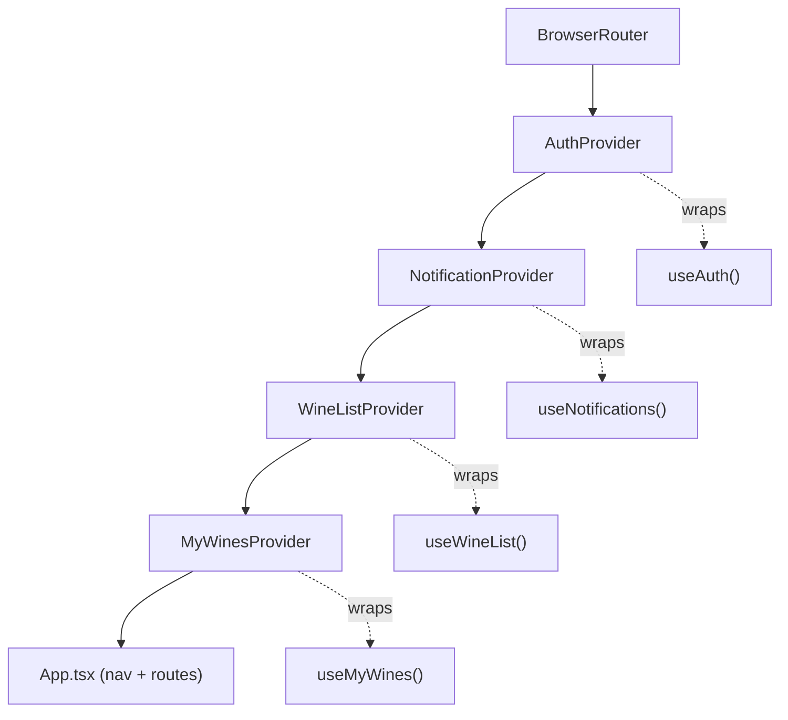
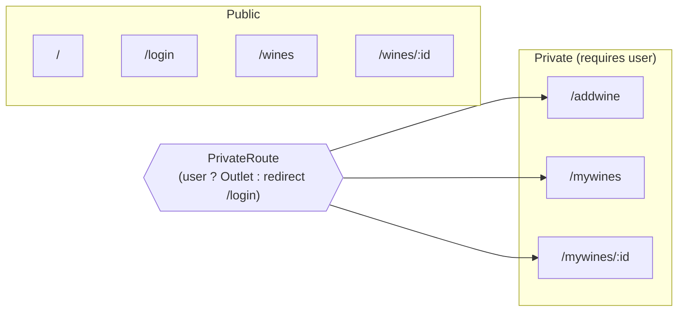
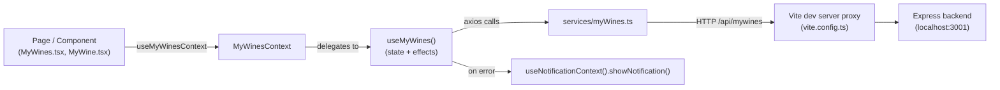
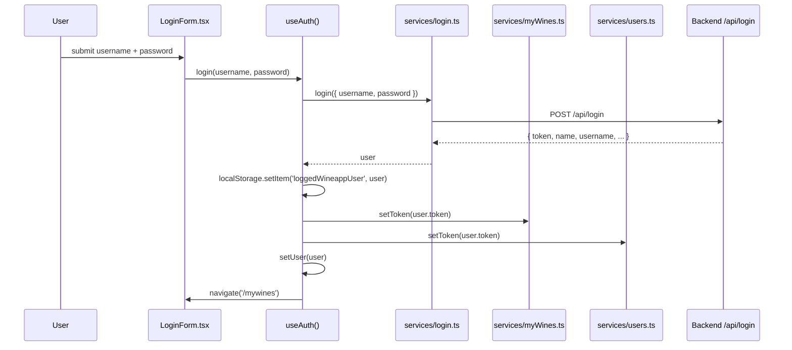
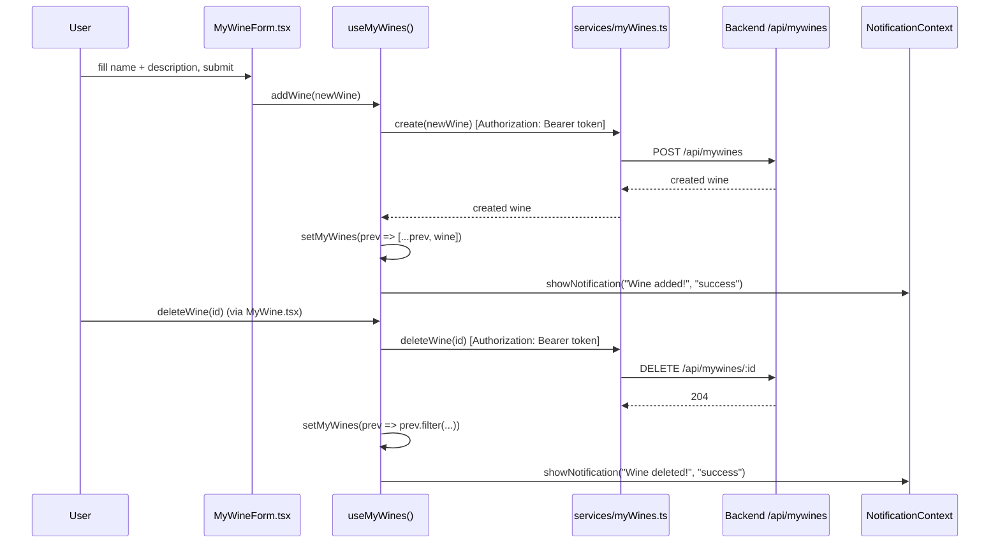

# KnowWine AI — Frontend Architecture

This document describes the structure of the `front/` application: how it's composed, how
state flows, and how it talks to the backend. Diagrams are written in [Mermaid](https://mermaid.js.org/)
and render automatically on GitHub/GitLab.

## 1. Tech stack

| Concern            | Choice                                    |
|---------------------|--------------------------------------------|
| UI framework        | React 19 + TypeScript                      |
| Build tool           | Vite 8                                     |
| Routing              | react-router-dom v7                        |
| HTTP client          | axios                                      |
| Component library    | MUI (`@mui/material`, `@mui/icons-material`) |
| Map rendering        | maplibre-gl (globe on the Home page)       |
| Unit / component tests | Vitest + Testing Library                 |
| E2E tests            | Playwright                                 |
| Linting / formatting | ESLint (typescript-eslint) + Prettier      |

State management is intentionally lightweight: no Redux/Zustand — just React Context wrapping
custom hooks.

## 2. Directory layout

```
front/src
├── main.tsx                 # entry point — mounts Router + all context Providers
├── App.tsx                  # top nav, route table
├── context/                 # React Context wrappers (one per domain)
│   ├── AuthContext.tsx
│   ├── MyWinesContext.tsx
│   ├── NotificationContext.tsx
│   └── WineListContext.tsx
├── hooks/                    # the actual state + logic behind each context
│   ├── useAuth.ts
│   ├── useMyWines.ts
│   ├── useNotifications.ts
│   └── useWineList.ts
├── services/                  # axios wrappers, one per backend REST resource
│   ├── login.ts               #   /api/login
│   ├── myWines.ts              #   /api/mywines
│   ├── users.ts                 #   /api/users
│   └── wineList.ts               #   /api/wines
├── pages/                       # route-level screens
│   ├── Home.tsx
│   ├── LoginForm.tsx
│   ├── MyWineForm.tsx
│   ├── MyWines.tsx
│   └── WineList.tsx
└── components/                  # reusable / presentational pieces
    ├── common/PrivateRoute.tsx
    ├── Footer.tsx
    ├── MyWine.tsx
    ├── Notification.tsx
    ├── Toggable.tsx
    ├── WineSingle.tsx
    └── WineVisualization.tsx
```

## 3. Composition root — provider tree

`main.tsx` nests every context provider around `<App />`. Order matters: `AuthProvider` must
wrap everything that needs `user`, and `MyWinesProvider` sits inside `WineListProvider` and
`NotificationProvider` because `useMyWines` calls `useNotificationContext()` internally.



Each `*Context.tsx` follows the same pattern: it has no state of its own, it just runs the
matching hook once and exposes the result via `createContext` + a `useXContext()` accessor that
throws if called outside its provider. This keeps the context's type inferred from the hook, so
they can't drift apart.

## 4. Route map



`PrivateRoute` (`components/common/PrivateRoute.tsx`) is a layout route: it renders
`<Outlet />` when `user` is truthy, otherwise it redirects. `App.tsx` reads `user` from
`useAuthContext()` and passes it in, and also toggles which nav buttons are shown.

## 5. Data flow (Component → Context → Hook → Service → API)

Every domain follows the same four-layer flow. Example for wines a user has saved:



In dev, `vite.config.ts` proxies `/api/*` to `http://localhost:3001`, so the frontend and
backend can run on separate ports without CORS configuration.

## 6. Sequence: login



On mount, `useAuth`'s effect reads `loggedWineappUser` back out of `localStorage` and re-applies
the token to `myWineService` and `userService`, so a page refresh doesn't lose the session.

## 7. Sequence: add / delete a wine



**Note on auth headers:** `services/myWines.ts` only attaches the `Authorization` header on
`create` and `deleteWine`. `getAll` and `update` currently send no auth header — this is
reflected in the code comment at the top of that file and is worth closing before relying on
per-user data isolation for those two operations.

## 8. Component inventory

| Component | Role | Notable props |
|---|---|---|
| `App.tsx` | Top-level layout: nav bar, `<Routes>` table, wires all contexts together | — |
| `pages/Home.tsx` | Landing page; renders a MapLibre GL globe | — |
| `pages/LoginForm.tsx` | Username/password form, calls `useAuthContext().login` | — |
| `pages/WineList.tsx` | Debounced search + MUI table over the full wine catalogue (`/wines`) | `wineList` |
| `pages/MyWines.tsx` | Search + list over the signed-in user's saved wines (`/mywines`) | — |
| `pages/MyWineForm.tsx` | Form to add a wine to "my wines" (`/addwine`) | `addWine` |
| `components/MyWine.tsx` | Single saved-wine detail row + delete button | `wine`, `id` |
| `components/WineSingle.tsx` | Single catalogue-wine detail row | `wine` |
| `components/common/PrivateRoute.tsx` | Route guard — redirects unauthenticated users | `user`, `redirectPath` |
| `components/Notification.tsx` | Renders the current toast from `NotificationContext` as an MUI `Alert` | `notification` |
| `components/Toggable.tsx` | Generic show/hide wrapper (button ↔ children) | `buttonLabel`, `children` |
| `components/WineVisualization.tsx` | Decorative animated SVG wine glass used on marketing surfaces | — |
| `components/Footer.tsx` | Static site footer | — |

## 9. Testing

- **Unit / component** (`front/tests/*.test.jsx`, Vitest + Testing Library): currently covers
  `MyWine` and `MyWineForm`.
- **E2E** (`front/e2e/*.spec.ts`, Playwright): `app.spec.ts`, `home.spec.ts`, `wines.spec.ts`
  drive the app through a real browser against the dev server + backend.

Run with:

```bash
npm run test        # vitest
npm run test:e2e     # playwright
```

## 10. Known rough edges (from the current code)

These aren't hidden — they're either TODOs already in the source or asymmetries worth knowing
about before extending the app:

- `services/myWines.ts`: `getAll` and `update` send no `Authorization` header (see §7).
- `pages/MyWineForm.tsx`: the new wine's `id` is a hardcoded placeholder (`1 + 1`) rather than
  server-assigned — relies on the backend response overwriting it via `addWine`'s `.then`.
- `App.tsx` has TODOs for preventing duplicate wines and for a "favourites" flow.
- `pages/MyWines.tsx` has commented-out filters for wine type/region/grape that aren't wired up
  yet.
